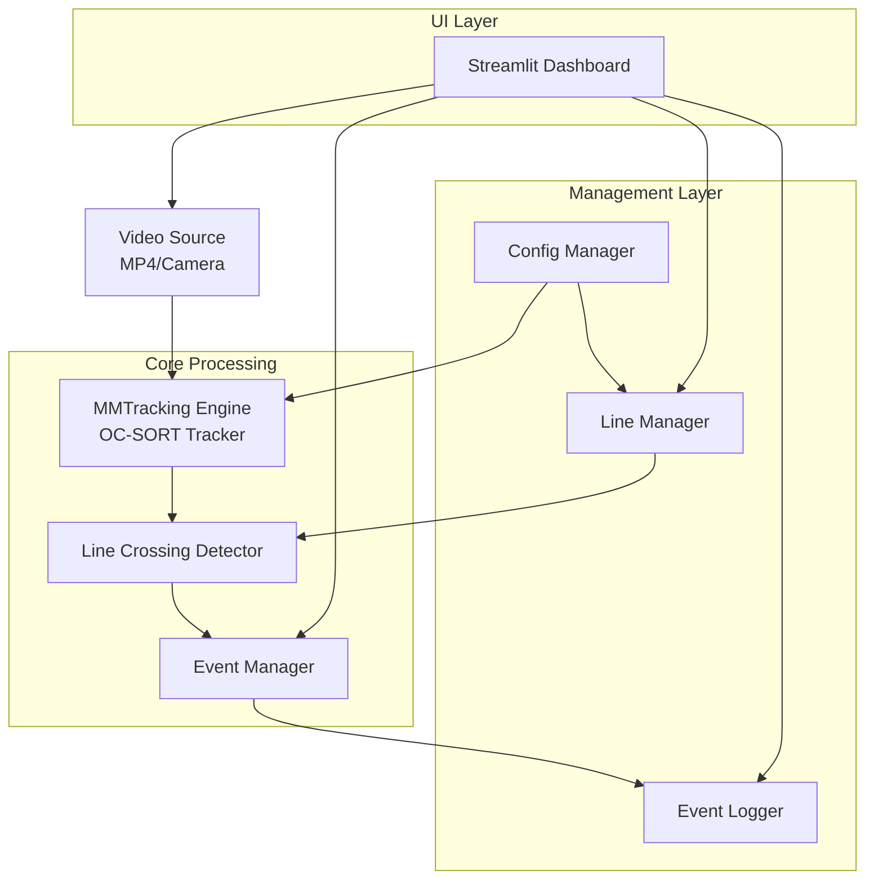

# 🎯 2D 출입관리 솔루션 MVP 데모 설계

## 📋 시스템 개요

### **목적**
MMTracking + OC-SORT 기반 2D 영상에서 가상 라인을 통한 실시간 출입 감지 및 모니터링 시스템

### **핵심 기술**
- **MMTracking**: OpenMMLab의 다중 객체 추적 프레임워크
- **OC-SORT**: Online Clustering for Robust Multi-Object Tracking
- **Streamlit**: 웹 인터페이스 및 대시보드
- **OpenCV**: 영상 처리 및 카메라 캡처
- **Shapely**: 기하학적 연산 (라인 교차 감지)

### **MVP 범위**
1. **영상 입력**: MP4 파일 또는 실시간 카메라 입력 지원
2. **실시간 추적**: MMTracking + OC-SORT 기반 객체 추적
3. **가상 라인 관리**: 웹에서 라인 생성/수정/삭제
4. **교차 감지**: 실시간 라인 교차 이벤트 감지
5. **모니터링 대시보드**: Streamlit 기반 실시간 모니터링
6. **이벤트 로깅**: 교차 이벤트 히스토리 관리

---

## 🏗️ 시스템 아키텍처



---

## 📁 단순화된 폴더 구조

```
line-crossing-tracking-demo/
├── src/                          # 핵심 비즈니스 로직
│   ├── core/                     # 핵심 데이터 모델
│   │   ├── __init__.py
│   │   ├── models.py             # DetectionResult, TrackingFrame, CrossingEvent
│   │   ├── enums.py              # CrossingDirection, CameraViewType
│   │   └── config.py             # 하드코딩된 기본 설정값
│   │
│   ├── tracking/                 # MMTracking + OC-SORT 객체 추적
│   │   ├── __init__.py
│   │   ├── engine.py             # ObjectTracker 클래스
│   │   ├── oc_sort.py            # OC-SORT 특화 기능
│   │   └── utils.py              # 추적 관련 유틸리티
│   │
│   ├── line_crossing/            # 가상 라인 및 교차 감지
│   │   ├── __init__.py
│   │   ├── detector.py           # LineCrossingDetector
│   │   ├── manager.py            # LineManager (CRUD)
│   │   └── geometry.py           # VirtualLine 클래스
│   │
│   ├── video/                    # 비디오 처리 모듈
│   │   ├── __init__.py
│   │   ├── source.py             # VideoSource (MP4/Camera 통합)
│   │   └── utils.py              # 비디오 관련 유틸리티
│   │
│   ├── events/                   # 간단한 출입 기록
│   │   ├── __init__.py
│   │   └── simple_logger.py      # SimpleEventLogger
│   │
│   └── utils/                    # 공통 유틸리티
│       ├── __init__.py
│       ├── logger.py             # 로깅 설정
│       └── image_utils.py        # 이미지 처리 유틸
│
├── streamlit_app/                # Streamlit 웹 애플리케이션
│   ├── __init__.py
│   ├── main.py                   # 메인 Streamlit 앱
│   ├── pages/                    # 페이지별 모듈
│   │   ├── __init__.py
│   │   ├── monitoring.py         # 실시간 모니터링 페이지
│   │   ├── line_management.py    # 라인 관리 페이지
│   │   └── entry_log.py          # 출입 기록 페이지
│   │
│   └── components/               # 재사용 가능한 UI 컴포넌트
│       ├── __init__.py
│       ├── video_display.py      # 비디오 표시 컴포넌트
│       ├── line_editor.py        # 라인 편집 컴포넌트
│       ├── simple_metrics.py     # 간단한 메트릭 컴포넌트
│       └── entry_log.py          # 출입 기록 컴포넌트
│
├── models/                       # ML 모델 파일들
│   ├── detection/
│   └── tracking/
│
├── configs/                      # 설정 파일들
│   └── line_configs.json         # 라인 설정 (동적 저장)
│
├── data/                         # 데이터 저장소
│   ├── sample.mp4               # 테스트용 MP4 파일
│   ├── snapshots/               # 출입자 스냅샷 이미지
│   │   └── 2025-01-15/          # 날짜별 폴더
│   ├── logs/                    # 출입 기록 CSV
│   │   ├── entry_log_2025-01.csv
│   │   └── app.log
│   └── temp/                    # 임시 파일
│
├── tests/                       # 테스트 코드
├── pyproject.toml               # Python 의존성
├── README.md
└── .gitignore
```

---

## 🎨 개선된 클래스 다이어그램

```mermaid
classDiagram
    %% Core Data Models
    class DetectionResult {
        +int track_id
        +tuple bbox
        +tuple center_point
        +float confidence
        +str class_name
        +float timestamp
        +dict features
        +to_dict() dict
        +from_dict(data) DetectionResult
    }
    
    class TrackingFrame {
        +int frame_id
        +float timestamp
        +List[DetectionResult] detections
        +np.ndarray raw_frame
        +dict metadata
        +get_detection_by_id(track_id) DetectionResult
        +filter_by_confidence(threshold) List[DetectionResult]
    }
    
    class CrossingEvent {
        +str event_id
        +int track_id
        +str line_id
        +CrossingDirection direction
        +tuple crossing_point
        +float timestamp
        +float confidence
        +DetectionResult detection_result
        +dict metadata
        +to_json() str
        +from_json(json_str) CrossingEvent
    }
    
    class VirtualLine {
        +str line_id
        +str name
        +tuple start_point
        +tuple end_point
        +bool is_active
        +CameraViewType view_type
        +LineString geometry
        +dict direction_config
        +float thickness
        +str color
        +validate_points() bool
        +calculate_distance_to_point(point) float
        +get_perpendicular_distance(point) float
        +_auto_detect_direction_config() dict
    }
    
    %% Enums
    class CrossingDirection {
        <<enumeration>>
        +IN
        +OUT
        +UNKNOWN
    }
    
    class CameraViewType {
        <<enumeration>>
        +ENTRANCE
        +CORRIDOR
        +ROOM
        +OUTDOOR
    }
    
    %% Core Processing Classes - Enhanced
    class ObjectTracker {
        -MMTrackingModel model
        -dict track_history
        -dict active_tracks
        -TrackingConfig config
        -int max_history_length
        -float confidence_threshold
        +initialize_model(config_path, checkpoint_path) bool
        +process_frame(frame, frame_id) TrackingFrame
        +get_track_trajectory(track_id, duration) List[tuple]
        +get_track_features(track_id) dict
        +cleanup_old_tracks() void
        +update_tracking_config(config) void
        -_parse_tracking_results(result, timestamp) List[DetectionResult]
        -_update_track_history(detections) void
        -_apply_nms(detections) List[DetectionResult]
        -_extract_features(detection) dict
    }
    
    class LineCrossingDetector {
        -dict virtual_lines
        -set recent_crossings
        -List[CrossingEvent] crossing_history
        -float crossing_threshold
        -int cooldown_frames
        -dict track_positions
        +add_virtual_line(line) bool
        +remove_virtual_line(line_id) bool
        +update_virtual_line(line_id, line) bool
        +detect_crossings(tracking_frame, track_history) List[CrossingEvent]
        +get_crossing_statistics(time_range) dict
        +clear_crossing_history() void
        -_is_line_crossed(prev_pos, curr_pos, virtual_line) bool
        -_determine_crossing_direction(prev_pos, curr_pos, virtual_line) CrossingDirection
        -_calculate_crossing_point(prev_pos, curr_pos, virtual_line) tuple
        -_validate_crossing_event(event) bool
        -_apply_cooldown_filter(events) List[CrossingEvent]
    }
    
    class VideoSource {
        -str source_path
        -cv2.VideoCapture cap
        -bool is_camera
        -int frame_width
        -int frame_height
        -float fps
        -bool is_opened
        +open(source) bool
        +read_frame() tuple[bool, np.ndarray]
        +get_fps() float
        +get_frame_count() int
        +get_current_position() int
        +set_position(frame_number) bool
        +get_frame_size() tuple
        +release() void
        +is_valid() bool
        -_validate_source(source) bool
    }
    
    class LineManager {
        -str config_file_path
        -dict lines
        -bool auto_save
        +create_line(name, start_point, end_point, **kwargs) str
        +update_line(line_id, **kwargs) bool
        +delete_line(line_id) bool
        +get_line(line_id) VirtualLine
        +get_all_lines() dict
        +get_active_lines() dict
        +toggle_line_status(line_id) bool
        +validate_line_config(line_data) bool
        +save_to_file() bool
        +load_from_file() bool
        +backup_config() bool
        +restore_from_backup() bool
        -_generate_line_id() str
        -_validate_line_data(data) bool
    }
    
    %% New Classes - MVP 단순화
    class SimpleEventLogger {
        -str log_file_path
        -str snapshot_dir
        -int daily_in_count
        -int daily_out_count
        +log_entry(track_id, direction, frame, timestamp) bool
        +save_snapshot(frame, track_id, timestamp) str
        +get_daily_count() dict
        +get_recent_entries(limit) List[dict]
        +export_to_csv(date_range) bool
        -_create_snapshot_filename(track_id, timestamp) str
        -_append_to_csv(entry_data) bool
    }
    
    %% OC-SORT Specific Classes
    class OCSOrtTracker {
        -KalmanFilter kalman_filter
        -dict observation_history
        -float direction_weight
        -int virtual_trajectory_length
        +predict() tuple
        +update(detection) void
        +apply_oru(last_observation, current_observation) void
        +calculate_ocm_cost(detection) float
        +recover_lost_track(detections) bool
        -_generate_virtual_trajectory(start, end, steps) List[tuple]
        -_calculate_direction_angle(pos1, pos2) float
        -_apply_observation_centric_update(observations) void
    }
    
    %% Streamlit Components - 단순화
    class StreamlitApp {
        -ObjectTracker tracker
        -LineCrossingDetector line_detector
        -LineManager line_manager
        -SimpleEventLogger event_logger
        -VideoSource video_source
        -dict session_state
        +run() void
        +initialize_components() bool
        +render_sidebar() void
        +render_main_content() void
        +handle_video_upload() bool
        +handle_camera_selection() bool
        -_setup_session_state() void
        -_handle_errors(error) void
    }
    
    class VideoDisplayComponent {
        -int display_width
        -int display_height
        -bool show_overlays
        +render_video_player(video_source) void
        +render_frame_with_overlays(frame, lines, detections) np.ndarray
        +handle_frame_processing() void
        +render_video_controls() void
        +handle_mouse_events() tuple
        -_draw_detections(frame, detections) np.ndarray
        -_draw_virtual_lines(frame, lines) np.ndarray
        -_draw_crossing_events(frame, events) np.ndarray
    }
    
    class LineEditorComponent {
        -VirtualLine current_line
        -bool edit_mode
        +render_line_creation_form() VirtualLine
        +render_line_list(lines) void
        +render_line_edit_form(line) void
        +handle_line_coordinates_input() tuple
        +handle_mouse_line_drawing() tuple
        +validate_line_input(line_data) bool
        -_render_line_properties_form(line) dict
        -_handle_line_preview(start, end) void
    }
    
    class SimpleMetricsComponent {
        -dict count_cache
        +render_entry_counts() void
        +render_recent_snapshots() void
        +render_daily_summary() void
        -_format_count_display(counts) dict
        -_load_recent_images(limit) List[str]
    }
    
    class EntryLogComponent {
        -int page_size
        -str sort_column
        +render_entry_table(entries) void
        +render_date_filter() dict
        +handle_csv_export() bool
        -_format_entry_data(entries) List[dict]
        -_apply_pagination(entries, page, size) List[dict]
    }
    
    %% Relationships - 단순화
    ObjectTracker --> TrackingFrame : creates
    ObjectTracker --> DetectionResult : creates
    ObjectTracker --> OCSOrtTracker : contains
    
    LineCrossingDetector --> CrossingEvent : creates
    LineCrossingDetector --> VirtualLine : manages
    
    LineManager --> VirtualLine : persists
    SimpleEventLogger --> CrossingEvent : logs
    
    StreamlitApp --> ObjectTracker : uses
    StreamlitApp --> LineCrossingDetector : uses
    StreamlitApp --> LineManager : uses
    StreamlitApp --> SimpleEventLogger : uses
    StreamlitApp --> VideoSource : uses
    
    TrackingFrame --> DetectionResult : contains
    CrossingEvent --> DetectionResult : references
    CrossingEvent --> CrossingDirection : uses
    VirtualLine --> CameraViewType : uses
    
    VideoDisplayComponent --> StreamlitApp : used_by
    LineEditorComponent --> StreamlitApp : used_by
    SimpleMetricsComponent --> StreamlitApp : used_by
    EntryLogComponent --> StreamlitApp : used_by
```



---

## 🚀 개선된 MVP 개발 단계

### **Phase 1: 핵심 데이터 모델 및 기본 인프라 (1-2주)**

#### **1.1 핵심 데이터 모델 구현**
```python
# src/core/models.py
- DetectionResult: 추적 결과 데이터 구조
- TrackingFrame: 프레임별 추적 정보
- CrossingEvent: 라인 교차 이벤트
- VirtualLine: 가상 라인 기하학적 정의

# src/core/enums.py  
- CrossingDirection: IN/OUT/UNKNOWN
- CameraViewType: ENTRANCE/CORRIDOR/ROOM/OUTDOOR
```

#### **1.2 비디오 처리 기반**
```python
# src/video/source.py
- VideoSource: MP4/Camera 통합 처리
- 프레임 읽기, FPS 제어, 해상도 관리
- 에러 처리 및 복구 로직
```

#### **1.3 간단한 설정 관리**
```python
# 하드코딩된 기본 설정 (src/core/config.py)
- DEFAULT_CONFIDENCE_THRESHOLD = 0.6
- DEFAULT_MAX_AGE = 30
- DEFAULT_MIN_HITS = 3
- 라인 설정만 line_configs.json으로 관리
```

### **Phase 2: MMTracking + OC-SORT 통합 (2-3주)**

#### **2.1 MMTracking 기본 통합**
```python
# src/tracking/engine.py
- ObjectTracker: MMTracking 모델 래퍼
- 모델 초기화 및 추론 파이프라인
- 추적 결과 파싱 및 후처리

# src/tracking/config.py
- 추적 모델 설정 관리
- 사전 훈련된 모델 다운로드 스크립트
```

#### **2.2 OC-SORT 특화 기능**
```python
# src/tracking/oc_sort.py
- OCSOrtTracker: OC-SORT 핵심 로직
- ORU (Observation-centric Re-Update)
- OCM (Observation-centric Momentum)  
- OCR (Observation-centric Recovery)
```

#### **2.3 성능 최적화**
```python
# 실시간 처리를 위한 최적화
- 비동기 프레임 처리
- 메모리 효율적인 추적 히스토리 관리
- GPU 가속 활용
```

### **Phase 3: 라인 교차 감지 시스템 (1-2주)**

#### **3.1 가상 라인 시스템**
```python
# src/line_crossing/geometry.py
- VirtualLine: Shapely 기반 기하학적 연산
- 라인-점 거리 계산, 교차 판정

# src/line_crossing/manager.py  
- LineManager: 라인 CRUD 및 영속성
- JSON 기반 설정 저장/복원
```

#### **3.2 교차 감지 엔진**
```python
# src/line_crossing/detector.py
- LineCrossingDetector: 실시간 교차 감지
- 방향 판단 알고리즘
- 중복 감지 방지 (쿨다운 필터)
- 교차점 정확도 향상
```

#### **3.3 간단한 출입 기록**
```python
# src/events/simple_logger.py
- SimpleEventLogger: 기본적인 출입 기록
- 출입자 사진 저장 (스냅샷)
- 간단한 카운팅 (IN/OUT)
- CSV 파일 기반 로깅
```

### **Phase 4: Streamlit 웹 인터페이스 (2-3주)**

#### **4.1 기본 대시보드**
```python
# streamlit_app/main.py
- 메인 애플리케이션 구조
- 사이드바 설정 패널
- 실시간 비디오 스트리밍

# streamlit_app/components/video_display.py
- 비디오 플레이어 컴포넌트
- 오버레이 렌더링 (추적 박스, 가상 라인)
- 마우스 이벤트 처리
```

#### **4.2 라인 관리 인터페이스**
```python
# streamlit_app/components/line_editor.py
- 마우스 클릭으로 라인 생성
- 라인 속성 편집 (이름, 색상)
- 실시간 라인 미리보기

# streamlit_app/pages/line_management.py
- 라인 목록 및 상태 관리
- 라인별 출입 카운트 표시
```

#### **4.3 간단한 모니터링**
```python
# streamlit_app/components/simple_metrics.py
- 실시간 출입 카운트 (IN/OUT)
- 오늘의 출입 통계
- 최근 출입자 사진 갤러리

# streamlit_app/pages/entry_log.py
- 출입 기록 테이블 (시간, 방향, 사진)
- 간단한 필터링 (날짜별)
- CSV 다운로드
```

---

## 🔧 기술적 고려사항

### **기술적 고려사항**

### **MMTracking 실용적 설정**
- **모델 선택**: OC-SORT
- **배치 처리**: 실시간성 우선, 배치 크기 1로 지연시간 최소화

### **Streamlit 제약사항**
- **상태 관리**: `st.session_state` 적극 활용으로 페이지 새로고침 문제 해결
- **성능**: 큰 데이터 표시 시 `st.cache_data` 데코레이터 사용
- **실시간 업데이트**: `st.rerun()` 사용하되 무한 루프 주의

### **MVP 단순화 원칙**
- **설정 관리**: 하드코딩된 기본값 사용, line_configs.json만 동적 관리
- **이벤트 처리**: 복잡한 이벤트 시스템 대신 간단한 CSV 로깅
- **사진 저장**: 출입 감지 시 자동 스냅샷 저장
- **데이터베이스**: 파일 기반 저장으로 충분

### **확장성 준비**
- **모듈화**: 각 컴포넌트 독립적 설계로 향후 API 분리 용이
- **설정 외부화**: 필수 설정만 외부화 (라인 설정)
- **데이터 구조**: 향후 DB 연동 가능하도록 추상화

---

## 📈 MVP 성공 기준

### **기능적 요구사항**
1. ✅ MP4 파일 및 웹캠 입력 모두 지원
2. ✅ 실시간 객체 추적 및 ID 유지
3. ✅ 웹에서 가상 라인 생성/수정/삭제
4. ✅ 라인 교차 시 실시간 감지 및 로깅

### **비기능적 요구사항**
1. ✅ 직관적인 웹 인터페이스
2. ✅ 설정 저장/복원 기능
3. ✅ 기본적인 에러 복구 및 로깅 시스템

**→ 이 설계서를 바탕으로 단계별 MVP 개발을 진행하면 견고하고 확장 가능한 2D 출입관리 솔루션을 구축할 수 있습니다!** 🎯