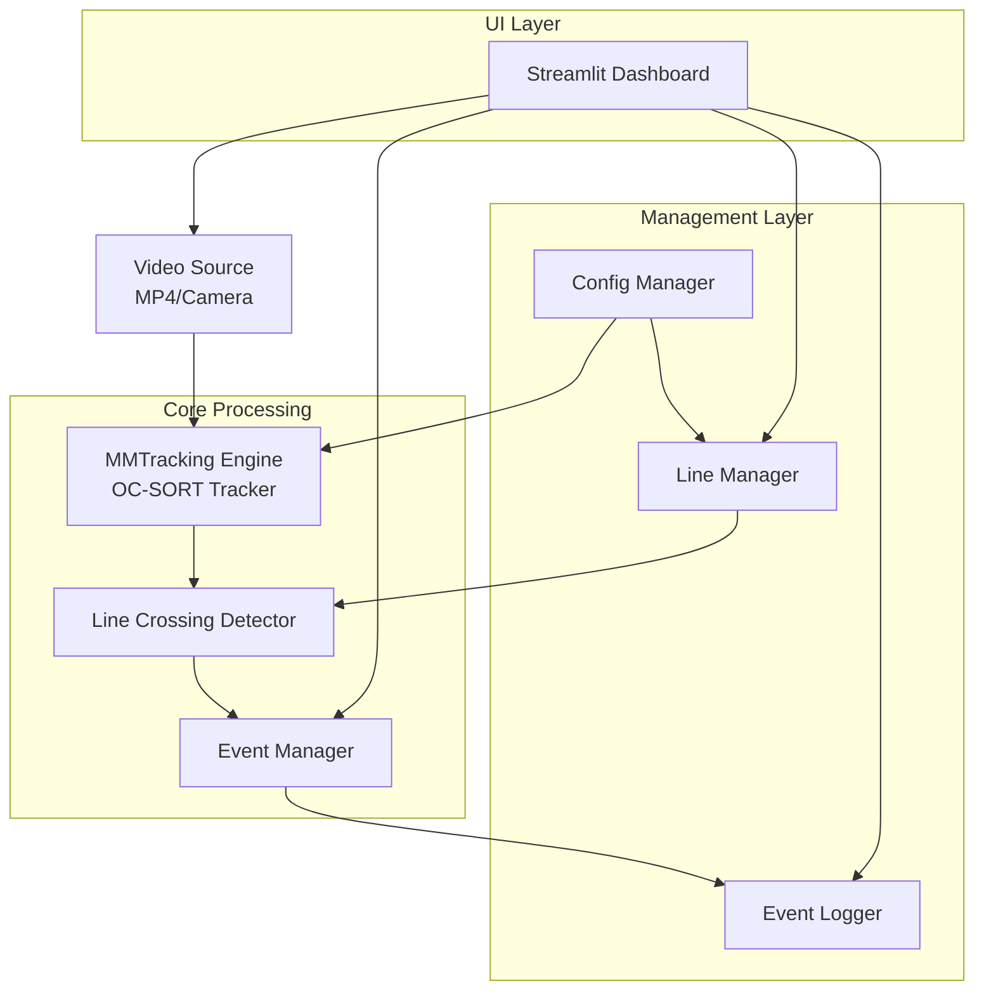
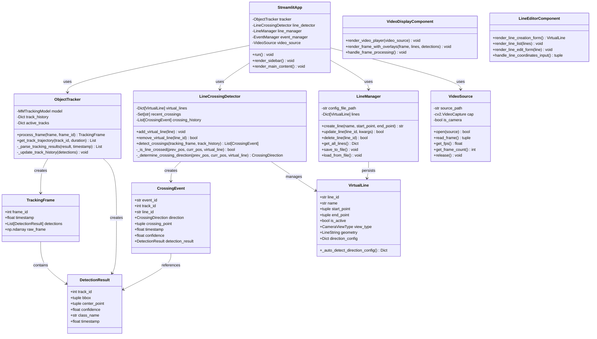

# 🎯 2D 출입관리 솔루션 MVP 데모 설계

## 📋 시스템 개요

### **목적**
MMTracking + OC-SORT 기반 2D 영상에서 가상 라인을 통한 실시간 출입 감지 및 모니터링 시스템

### **핵심 기술**
- **MMTracking**: OpenMMLab의 다중 객체 추적 프레임워크
- **OC-SORT**: Online Clustering for Robust Multi-Object Tracking
- **Streamlit**: 웹 인터페이스 및 대시보드
- **OpenCV**: 영상 처리 및 카메라 캡처
- **Shapely**: 기하학적 연산 (라인 교차 감지)

### **MVP 범위**
1. **영상 입력**: MP4 파일 또는 실시간 카메라 입력 지원
2. **실시간 추적**: MMTracking + OC-SORT 기반 객체 추적
3. **가상 라인 관리**: 웹에서 라인 생성/수정/삭제
4. **교차 감지**: 실시간 라인 교차 이벤트 감지
5. **모니터링 대시보드**: Streamlit 기반 실시간 모니터링
6. **이벤트 로깅**: 교차 이벤트 히스토리 관리

---

## 🏗️ 시스템 아키텍처



---

## 📁 폴더 구조

```
access_control_mvp/
├── src/                          # 핵심 비즈니스 로직
│   ├── core/                     # 핵심 데이터 모델
│   │   ├── __init__.py
│   │   ├── models.py             # DetectionResult, TrackingFrame, CrossingEvent
│   │   └── enums.py              # CrossingDirection, CameraViewType
│   │
│   ├── tracking/                 # MMTracking + OC-SORT 객체 추적
│   │   ├── __init__.py
│   │   ├── engine.py             # ObjectTracker 클래스
│   │   ├── config.py             # 추적 모델 설정 관리
│   │   └── utils.py              # 추적 관련 유틸리티
│   │
│   ├── line_crossing/            # 가상 라인 및 교차 감지
│   │   ├── __init__.py
│   │   ├── detector.py           # LineCrossingDetector
│   │   ├── manager.py            # LineManager (CRUD)
│   │   ├── geometry.py           # VirtualLine 클래스
│   │   └── validators.py         # 교차 검증 로직
│   │
│   ├── video/                    # 비디오 처리 모듈
│   │   ├── __init__.py
│   │   ├── source.py             # VideoSource (MP4/Camera 통합)
│   │   ├── processor.py          # VideoProcessor (프레임 처리)
│   │   └── utils.py              # 비디오 관련 유틸리티
│   │
│   └── utils/                    # 공통 유틸리티
│       ├── __init__.py
│       ├── logger.py             # 로깅 설정
│       ├── image_utils.py        # 이미지 처리 유틸
│       └── file_utils.py         # 파일 처리 유틸
│
├── streamlit_app/                # Streamlit 웹 애플리케이션
│   ├── __init__.py
│   ├── main.py                   # 메인 Streamlit 앱
│   ├── pages/                    # 페이지별 모듈
│   │   ├── __init__.py
│   │   ├── monitoring.py         # 실시간 모니터링 페이지
│   │   ├── line_management.py    # 라인 관리 페이지
│   │   ├── event_history.py      # 이벤트 히스토리 페이지
│   │   └── settings.py           # 설정 페이지
│   │
│   ├── components/               # 재사용 가능한 UI 컴포넌트
│   │   ├── __init__.py
│   │   ├── video_display.py      # 비디오 표시 컴포넌트
│   │   ├── line_editor.py        # 라인 편집 컴포넌트
│   │   ├── event_table.py        # 이벤트 테이블 컴포넌트
│   │   └── metrics_display.py    # 메트릭 표시 컴포넌트
│   │
│   └── utils/                    # Streamlit 전용 유틸리티
│       ├── __init__.py
│       ├── session_state.py      # 세션 상태 관리
│       ├── layout.py             # 레이아웃 헬퍼
│       └── styling.py            # CSS 스타일링
│
├── models/                       # ML 모델 파일들
│
├── configs/                      # 설정 파일들
│   └── line_configs.json         # 라인 설정 (동적 저장)
│
├── data/                         # 데이터 저장소
│   ├── videos/                   # 테스트용 MP4 파일들
│   │   ├── sample_entrance.mp4
│   │   └── sample_corridor.mp4
│   ├── events/                   # 이벤트 로그
│   │   ├── events_2025.json
│   │   └── daily_summary.csv
│   ├── snapshots/               # 스냅샷 이미지 (선택사항)
│   └── logs/                    # 시스템 로그
│       └── app.log
│
├── tests/                       # 테스트 코드
│
├── scripts/                     # 유틸리티 스크립트
│   ├── setup_models.py         # 모델 다운로드 및 설정
│
├── pyproject.toml               # Python 의존성
├── environment.yml              # Conda 환경 파일
├── README.md
├── .gitignore
└── .streamlit/                  # Streamlit 설정
    └── config.toml
```

---

## 🎨 클래스 다이어그램



---


```

---

## 🚀 MVP 개발 단계

### **Phase 1: 기본 인프라 구축**
1. **환경 설정**
   - MMTracking 설치 및 모델 다운로드
   - Streamlit 기본 레이아웃 구성

2. **비디오 처리**
   - VideoSource 클래스 구현 (MP4/Camera 지원)
   - 기본 프레임 표시 기능
   - FPS 제어 및 성능 최적화

### **Phase 2: 객체 추적 구현**
1. **MMTracking 통합**
   - ObjectTracker 클래스 구현
   - OC-SORT 모델 로딩 및 추론
   - 추적 결과 시각화


### **Phase 3: 라인 교차 감지**
1. **가상 라인 시스템**
   - VirtualLine 클래스 구현
   - Shapely 기반 기하학적 연산
   - 라인 시각화 오버레이

2. **교차 감지 로직**
   - LineCrossingDetector 구현
   - 방향 판단 알고리즘
   - 중복 감지 방지

### **Phase 4: 웹 인터페이스**
1. **Streamlit 대시보드**
   - 실시간 비디오 스트리밍
   - 출입 Counting 화면에 표시
   - 라인 관리 UI (생성/수정/삭제)

2. **상호작용 기능**
   - 마우스 클릭으로 라인 좌표 설정
   - 실시간 설정 변경 적용
   - 통계 및 차트 표시

---

## 📊 성능 목표

### **처리 성능**
- **실시간 처리**: 30fps 영상에서 10-20fps 처리 속도
- **지연시간**: 프레임 입력부터 결과 표시까지 < 500ms

### **정확도 목표**
- **추적 정확도**: MOTA(Multiple Object Tracking Accuracy) > 65%
- **라인 교차 감지**: False Positive < 10%, False Negative < 15%
- **ID 스위칭**: 실용적 수준
---

## 🔧 기술적 고려사항

### **기술적 고려사항**

### **MMTracking 실용적 설정**
- **모델 선택**: OC-SORT
- **배치 처리**: 실시간성 우선, 배치 크기 1로 지연시간 최소화

### **Streamlit 제약사항**
- **상태 관리**: `st.session_state` 적극 활용으로 페이지 새로고침 문제 해결
- **성능**: 큰 데이터 표시 시 `st.cache_data` 데코레이터 사용
- **실시간 업데이트**: `st.rerun()` 사용하되 무한 루프 주의

### **확장성 준비**
- **모듈화**: 각 컴포넌트 독립적 설계로 향후 API 분리 용이
- **설정 외부화**: 하드코딩 최소화, YAML/JSON 설정 파일 활용
- **데이터베이스 준비**: 현재는 파일 기반, 향후 DB 연동 가능하도록 추상화

---

## 📈 MVP 성공 기준

### **기능적 요구사항**
1. ✅ MP4 파일 및 웹캠 입력 모두 지원
2. ✅ 실시간 객체 추적 및 ID 유지
3. ✅ 웹에서 가상 라인 생성/수정/삭제
4. ✅ 라인 교차 시 실시간 감지 및 로깅

### **비기능적 요구사항**
1. ✅ 직관적인 웹 인터페이스
2. ✅ 설정 저장/복원 기능
3. ✅ 기본적인 에러 복구 및 로깅 시스템

**→ 이 설계서를 바탕으로 단계별 MVP 개발을 진행하면 견고하고 확장 가능한 2D 출입관리 솔루션을 구축할 수 있습니다!** 🎯