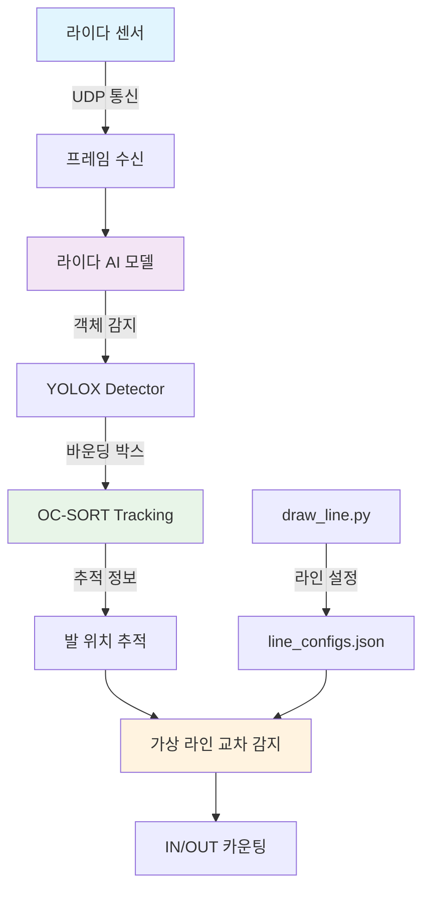

# 라이다 기반 객체 추적 및 라인 크로싱 감지 시스템

**라이다 센서 + AI 모델 + OC-SORT 추적을 통한 실시간 출입 감지 시스템**

## 🎯 시스템 개요

라이다 센서에서 UDP 통신으로 프레임 데이터를 수신하고, 라이다 전용 학습 모델을 통해 객체를 감지한 후, OC-SORT로 추적하여 가상 라인 교차를 감지하는 시스템입니다.

## 🛠️ 설치 및 환경 설정 (Windows)

### 1. 사전 요구 사항
- Python 3.11+
- Git
- uv (Python 패키지 관리자)

### 2. uv 설치(window - powershell)
```powershell
# Scoop이 설치되어 있지 않다면 먼저 설치
Set-ExecutionPolicy -ExecutionPolicy RemoteSigned -Scope CurrentUser
Invoke-RestMethod -Uri https://get.scoop.sh | Invoke-Expression

# uv 설치
scoop install uv
```
os 상관없이 uv만 설치하면 됩니다.


### 3. 프로젝트 클론 및 설치
```bash
git clone <repository-url>
cd line-crossing-tracking-demo
uv sync --group dev
```

## 🚀 실행 방법

### 1단계: 가상 라인 그리기
```bash
python draw_line.py
```

**기능:**
- 라이다 센서 화면에서 마우스로 가상 라인 그리기
- 센서별 개별 라인 설정 관리
- 라인 설정 자동 저장 (`configs/line_configs.json`)

**사용법:**
- 좌클릭: 시작점/끝점 설정
- `S`: 라인 저장
- `R`: 라인 초기화
- `ESC`: 종료

### 2단계: 객체 추적 및 라인 크로싱 감지
```bash
python tests/test_tracking_line_crossing_lidar.py
```

**기능:**
- 라이다 센서 데이터 실시간 수신 (UDP)
- 라이다 전용 학습 모델로 객체 감지
- OC-SORT 알고리즘으로 객체 추적
- 발 추적 기반 정확한 라인 크로싱 감지
- 실시간 IN/OUT 카운팅

## 📊 시스템 플로우


```mermaid
graph TD
    A[라이다 센서] -->|UDP 통신| B[프레임 수신]
    B --> C[라이다 AI 모델]
    C -->|객체 감지| D[YOLOX Detector]
    D -->|바운딩 박스| E[OC-SORT Tracking]
    E -->|추적 정보| F[발 위치 추적]
    F --> G[가상 라인 교차 감지]
    G --> H[IN/OUT 카운팅]
    
    I[draw_line.py] -->|라인 설정| J[line_configs.json]
    J --> G
    
    style A fill:#e1f5fe
    style C fill:#f3e5f5
    style E fill:#e8f5e8
    style G fill:#fff3e0
```

## 🧠 핵심 기술

### 1. 라이다 데이터 처리
- **UDP 통신**: 실시간 라이다 프레임 수신
- **멀티 센서 지원**: 센서별 개별 설정 관리
- **프레임 단위 처리**: 연속적인 이미지 스트림 처리

### 2. AI 모델 추론
- **라이다 전용 모델**: 라이다 데이터에 특화된 학습 모델
- **객체 감지**: 사람 객체 감지 및 바운딩 박스 생성
- **YOLOX 백본**: 고성능 객체 감지 엔진

### 3. 객체 추적 (OC-SORT)
- **7차원 칼만 필터**: 위치, 크기, 속도 예측
- **ID 일관성**: 동일 객체 지속적 추적
- **다중 객체 처리**: 여러 객체 동시 추적

### 4. 라인 크로싱 감지
- **발 추적 모드**: `TrackingPointMode.BOTTOM_CENTER`
- **CCW 알고리즘**: 수학적 교차 판정
- **방향 감지**: 벡터 외적 기반 IN/OUT 판정
- **중복 방지**: 시간 기반 이벤트 필터링

## 📁 핵심 파일 구조

```
line-crossing-tracking-demo/
├── draw_line.py                              # 가상 라인 그리기 도구
├── tests/
│   └── test_tracking_line_crossing_lidar.py  # 메인 추적 시스템
├── configs/
│   └── line_configs.json                     # 라인 설정 파일
├── src/
│   ├── lidar/
│   │   └── data_receiver.py                  # 라이다 데이터 수신
│   ├── tracking/
│   │   ├── engine.py                         # 추적 엔진
│   │   ├── yolox_detector.py                 # YOLOX 감지기
│   │   └── ocsort_tracker/                   # OC-SORT 구현
│   └── line_crossing/
│       ├── detector.py                       # 라인 크로싱 감지
│       └── modes.py                          # 추적 포인트 모드
└── *.pt, *.shas                             # 라이다 AI 모델 파일
```

## ⚙️ 설정 옵션

### 추적 포인트 모드
```python
# src/line_crossing/modes.py
TrackingPointMode.BOTTOM_CENTER  # 발 추적 (기본값)
TrackingPointMode.CENTER         # 중심점 추적
TrackingPointMode.TOP_CENTER     # 머리 추적
```

### 검출 설정
```python
# 신뢰도 임계값 조정
detector_config="crowded_scene"  # 복잡한 환경 (임계값 0.25)
detector_config="balanced"       # 균형잡힌 설정 (임계값 0.6)
```


## 📝 개발 노트

- **패키지 관리**: `uv` 사용
- **모델 형식**: PyTorch `.pt` 파일
- **설정 관리**: JSON 기반 라인 설정
- **통신**: UDP 프로토콜 사용
- **추적 알고리즘**: OC-SORT 공식 구현체 활용
